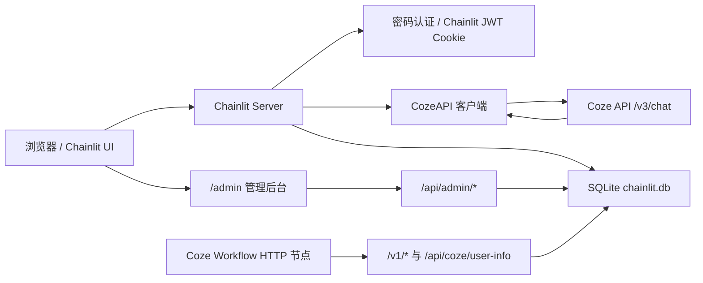

# 灵犀智学 Chainlit

面向“计算机三级网络技术”学习场景的 Chainlit 聊天应用。项目将 Chainlit 对话界面、FastAPI 管理后台、Coze Bot/Workflow 调用、每日一练/作业成绩回调和 SQLite 持久化集中在一个 Python 服务中，适合在本地、教学服务器或 Docker Compose 环境中部署。

## 核心能力

- Chainlit 密码登录，支持 `admin` 和 `user` 两类角色。
- Coze 对话接入，支持 Service Identity Token 和管理员 OAuth 授权两种 token 来源。
- 流式 SSE 输出，支持 Coze Workflow `requires_action` 挂起与续接。
- 三种对话人设：`新手小白`、`辩论对手`、`计网专家`，默认使用 `计网专家`。
- 管理后台 `/admin`，提供用户管理、配置管理、对话查看、活跃度统计、排行榜管理。
- 每日一练 API，支持开始练习、逐题更新、一次性提交成绩、查询排行榜。
- 作业成绩 API，支持 Coze 工作流批改后回调写入成绩和反馈。
- SQLite 持久化 Chainlit 历史消息、用户、配置、活动日志、人设使用记录、练习记录和排行榜。

## 技术栈

| 层级 | 技术 |
| --- | --- |
| Web UI | Chainlit |
| HTTP API | FastAPI, Starlette middleware |
| 异步 HTTP | aiohttp |
| 数据层 | SQLite, SQLAlchemy async, aiosqlite |
| 配置 | python-dotenv, `.env` |
| 容器 | Docker, Docker Compose |
| 前端静态资源 | `public/*.css`, `public/*.js`, `templates/admin.html` |

## 目录结构

```text
.
├── app.py                    # 主应用：Chainlit 事件、FastAPI 路由、Coze 客户端、业务逻辑
├── init_db.py                # SQLite 表结构初始化和增量迁移脚本
├── init_db.sql               # 早期/参考 SQL 初始化脚本
├── requirements.txt          # Python 依赖
├── Dockerfile                # Python 3.11 slim 镜像构建
├── docker-compose.yml        # 容器部署，宿主机 8123 -> 容器 8000
├── deploy.sh                 # Linux Docker Compose 部署辅助脚本
├── chainlit.md               # Chainlit 欢迎/说明页内容
├── .chainlit/config.toml     # Chainlit UI 和功能配置
├── templates/admin.html      # 管理后台页面
├── public/
│   ├── admin.js/css          # 管理后台交互和样式
│   ├── leaderboard.js/css    # 排行榜浮层
│   ├── theme.css             # Chainlit 自定义主题
│   └── logo/icon/favicon     # 品牌和图标资源
└── users/                    # 用户数据导入样例或运营数据文件
```

## 运行架构



主入口是 `app.py`。它同时做三件事：

1. 通过 `@cl.password_auth_callback`、`@cl.on_chat_start`、`@cl.on_message` 等 Chainlit hook 承接聊天生命周期。
2. 通过 `chainlit.server.app` 注册 FastAPI 路由，例如 `/admin`、`/api/admin/*`、`/v1/practice/*`。
3. 通过 `SQLAlchemyDataLayer` 将 Chainlit 的用户、线程、步骤、反馈、元素等数据落到 SQLite。

## 快速开始

### 1. 准备环境变量

在项目根目录创建或更新 `.env`：

```env
CHAINLIT_AUTH_SECRET=replace-with-a-long-random-secret

COZE_BASE_URL=https://api.coze.cn
COZE_BOT_ID=replace-with-your-bot-id
COZE_JWT_TOKEN=replace-with-service-identity-token
COZE_JWT_EXPIRES_AT=

COZE_CLIENT_ID=
COZE_CLIENT_SECRET=
COZE_REDIRECT_URL=http://localhost:8000/oauth/callback

ADMIN_USERNAME=admin
ADMIN_PASSWORD=replace-with-strong-password
```

`COZE_JWT_TOKEN` 是生产推荐路径。`COZE_CLIENT_ID` 和 `COZE_CLIENT_SECRET` 只在需要管理员 OAuth 授权时必填。

### 2. 本地运行

Windows PowerShell:

```powershell
python -m venv .venv
.\.venv\Scripts\Activate.ps1
pip install -r requirements.txt
python init_db.py
chainlit run app.py --host 0.0.0.0 --port 8000
```

Linux/macOS:

```bash
python3 -m venv .venv
source .venv/bin/activate
pip install -r requirements.txt
python init_db.py
chainlit run app.py --host 0.0.0.0 --port 8000
```

访问地址：

- 聊天界面：`http://localhost:8000`
- 管理后台：`http://localhost:8000/admin`
- OAuth 回调：`http://localhost:8000/oauth/callback`

### 3. Docker Compose 运行

```bash
docker compose up --build -d
docker compose logs -f
```

默认端口映射：

```text
宿主机 http://localhost:8123 -> 容器 http://0.0.0.0:8000
```

Docker Compose 会挂载：

| 宿主机路径 | 容器路径 | 用途 |
| --- | --- | --- |
| `./data` | `/app/data` | SQLite 持久化数据 |
| `./public` | `/app/public` | 静态资源热更新 |
| `./app.py` | `/app/app.py` | 主应用热替换 |

Linux 服务器也可以使用部署脚本：

```bash
chmod +x deploy.sh
./deploy.sh                 # 自动检测服务器 IP
./deploy.sh 1.2.3.4         # 手动指定公网 IP
```

脚本会将 `docker-compose.yml` 中的 `COZE_REDIRECT_URL` 改为 `http://<server-ip>:8123/oauth/callback`。如果该文件由配置管理系统维护，执行脚本前建议先备份。

## 配置项

| 变量 | 必填 | 默认值 | 说明 |
| --- | --- | --- | --- |
| `CHAINLIT_AUTH_SECRET` | 是 | 无 | Chainlit 认证 cookie/JWT 加密密钥。部署时必须设置为高强度随机值。 |
| `COZE_BASE_URL` | 否 | `https://api.coze.cn` | Coze API 基地址。 |
| `COZE_BOT_ID` | 是 | 无 | Coze Bot ID。 |
| `COZE_JWT_TOKEN` | 推荐 | 无 | Service Identity Token。普通用户默认使用此 token 调用 Coze。 |
| `COZE_JWT_EXPIRES_AT` | 否 | 无 | Service Identity Token 的 Unix 秒级过期时间。为空时按长期 token 处理。 |
| `COZE_CLIENT_ID` | OAuth 时必填 | 无 | Coze OAuth Client ID。 |
| `COZE_CLIENT_SECRET` | OAuth 时必填 | 无 | Coze OAuth Client Secret。 |
| `COZE_REDIRECT_URL` | OAuth 时必填 | `http://localhost:8000/oauth/callback` | Coze OAuth 回调地址，必须加入 Coze 开发者平台回调白名单。 |
| `ADMIN_USERNAME` | 否 | 代码内置值 | 启动时自动保证存在的管理员账号。 |
| `ADMIN_PASSWORD` | 否 | 代码内置值 | 启动时自动保证存在的管理员密码。生产环境必须显式覆盖。 |

运行时配置也会写入 `app_config` 表。启动时，环境变量先加载，随后数据库中的非空配置会覆盖内存配置，因此管理后台修改后的 Coze 配置可以跨重启保留。

## 数据库

### 数据库路径优先级

`app.py` 运行时按以下顺序选择数据库：

1. 存在 `/app/data`：使用 `/app/data/chainlit.db`，这是 Docker 环境路径。
2. 存在 `data/chainlit.db`：使用 `data/chainlit.db`。
3. 存在 `data` 目录：使用 `data/chainlit.db`。
4. 否则回退到 `.chainlit/chainlit.db`。

`init_db.py` 的本地回退路径略有不同：如果没有 `data` 目录，会使用当前目录下的 `chainlit.db`。本地开发时建议先创建 `data` 目录，保证初始化脚本和应用使用同一个数据库：

```powershell
New-Item -ItemType Directory -Force data
python init_db.py
```

### 主要表

| 表 | 来源 | 作用 |
| --- | --- | --- |
| `users` | Chainlit | Chainlit 用户记录。 |
| `threads` | Chainlit | 对话线程。 |
| `steps` | Chainlit | 用户消息、助手消息和运行步骤。 |
| `elements` | Chainlit | 文件、图片等元素。 |
| `feedbacks` | Chainlit | 消息反馈。 |
| `attachments` | Chainlit | 附件记录。 |
| `app_users` | 应用 | 登录账号、密码、角色。 |
| `app_config` | 应用 | Coze Bot、token、OAuth 等运行配置。 |
| `app_activity_logs` | 应用 | 登录、注册、管理操作等活动日志。 |
| `conversation_user_map` | 应用 | Coze `conversation_id` 到用户名的映射。 |
| `persona_usage_logs` | 应用 | 用户人设选择和使用统计。 |
| `practice_records` | 练习 | 每次练习成绩、答题数、连对数。 |
| `mistake_details` | 练习 | 错题明细。 |
| `user_leaderboard` | 练习/作业 | 累计分、最高分、参与次数。 |
| `assignment_records` | 作业 | 作业成绩和反馈。 |

`init_db.py` 是幂等脚本，会创建缺失表，并迁移旧版 `steps` 表的 `autoCollapse` 字段。练习相关 API 每次调用前也会执行轻量级建表保护，避免旧数据库缺表。

## Coze 对接

### Token 选择策略

`get_valid_token()` 的逻辑：

| 用户角色 | 优先级 |
| --- | --- |
| 管理员 | 1. 管理员自己的 OAuth token；2. 系统级 `COZE_JWT_TOKEN` |
| 普通用户 | 1. 系统级 `COZE_JWT_TOKEN` |

OAuth token 带 refresh token 时，`refresh_coze_token()` 会在过期前 5 分钟尝试刷新。Service Identity Token 配置了 `COZE_JWT_EXPIRES_AT` 时，会在过期前 1 小时视为不可用。

### Chat API 调用

应用向 Coze 发起流式请求：

```text
POST {COZE_BASE_URL}/v3/chat?conversation_id=<conversation_id>
```

核心 payload：

```json
{
  "bot_id": "<COZE_BOT_ID>",
  "user_id": "<username>",
  "additional_messages": [
    {
      "role": "user",
      "content": "<user message>",
      "content_type": "text"
    }
  ],
  "stream": true,
  "auto_save_history": true,
  "custom_variables": {
    "username": "<username>",
    "target_role": "计网专家"
  }
}
```

Coze 工作流可以读取 `custom_variables.username` 和 `custom_variables.target_role`。如果工作流 HTTP 节点需要反查用户，也可以调用：

```text
GET /api/coze/user-info?conversation_id=<coze-conversation-id>
```

成功响应：

```json
{
  "code": 0,
  "data": {
    "username": "alice",
    "role": "user"
  }
}
```

### Workflow 挂起续接

当 Coze SSE 返回 `requires_action`：

- 如果 tool call 类型是 `reply_message`，应用会继续调用 `/v3/chat`，让 Coze 在同一 conversation 内续接。
- 如果 tool call 有有效 `tool_call_id`，应用会调用：

```text
POST {COZE_BASE_URL}/v3/chat/submit_tool_outputs?conversation_id=<conversation_id>&chat_id=<chat_id>
```

并提交：

```json
{
  "stream": true,
  "tool_outputs": [
    {
      "tool_call_id": "<tool_call_id>",
      "output": "<user answer>"
    }
  ]
}
```

挂起状态保存在 Chainlit `user_session` 的 `pending_tool_action` 中。

## Chat 命令

| 命令 | 角色 | 作用 |
| --- | --- | --- |
| `/help` | 全部 | 查看可用命令。 |
| `/password`、`/密码`、`/passwd` | 全部 | 修改自己的登录密码。 |
| `/model` | 管理员 | 在聊天界面配置 Service Identity Token 和 Bot ID。 |
| `/config` | 管理员 | 在聊天界面配置 OAuth Client ID/Secret。 |
| `/oauth` | 管理员 | 发起 Coze OAuth 授权流程。 |
| `/register` | 管理员 | 交互式注册用户。 |
| `/users` | 管理员 | 交互式用户管理。 |

## HTTP API

### 认证说明

管理后台 API 依赖 Chainlit 登录后的 cookie/JWT。`verify_admin_from_request()` 会从 cookie 中读取 token，解码出 Chainlit 用户，再校验用户角色是否为 `admin`。

普通业务回调 API `/v1/*` 当前没有额外鉴权，设计上用于 Coze Workflow 或受控内网服务回调。若要暴露到公网，建议增加共享密钥、签名或网关鉴权。

### 用户人设

```http
GET /api/target-role
```

返回当前用户人设。未设置时返回 `计网专家`。

```http
POST /api/target-role
Content-Type: application/json

{
  "target_role": "新手小白"
}
```

`target_role` 只允许：

- `新手小白`
- `辩论对手`
- `计网专家`

### 管理后台

| 方法 | 路径 | 说明 |
| --- | --- | --- |
| `GET` | `/admin` | 管理后台 HTML。 |
| `GET` | `/api/admin/auth/check` | 检查当前登录用户是否为管理员。 |
| `GET` | `/api/admin/stats` | 总用户、活跃用户、对话数、token 健康、人设统计、活跃时段等。 |
| `GET` | `/api/admin/users` | 获取用户列表。 |
| `POST` | `/api/admin/users` | 创建单个用户。 |
| `POST` | `/api/admin/users/batch` | 批量导入用户，接收 base64 CSV。 |
| `PUT` | `/api/admin/users/{username}` | 修改用户密码和角色。 |
| `PUT` | `/api/admin/users/{username}/role` | 修改用户角色。 |
| `PUT` | `/api/admin/users/{username}/password` | 修改用户密码。 |
| `DELETE` | `/api/admin/users/{username}` | 删除用户。 |
| `GET` | `/api/admin/config` | 获取 Coze 配置。 |
| `PUT` | `/api/admin/config` | 更新 Coze 配置并写入 `app_config`。 |
| `GET` | `/api/admin/test-connection` | 使用系统 token 访问 Coze `/v1/bots`，测试连通性。 |
| `GET` | `/api/admin/conversations` | 获取最近最多 1000 条对话线程摘要。 |
| `GET` | `/api/admin/conversations/{thread_id}` | 获取指定线程中的用户/助手消息。 |
| `GET` | `/api/admin/leaderboard?period=all|today` | 管理后台排行榜。 |
| `PUT` | `/api/admin/leaderboard/{username}` | 修改用户排行榜分数。 |
| `DELETE` | `/api/admin/leaderboard/{username}?period=all|today` | 重置用户排行榜记录。 |

创建用户示例：

```http
POST /api/admin/users
Content-Type: application/json

{
  "username": "alice",
  "password": "alice-password",
  "role": "user"
}
```

批量导入用户的 CSV 字段顺序：

```csv
username,password,role
alice,alice-password,user
bob,bob-password,admin
```

前端会将 CSV bytes base64 后提交：

```json
{
  "file_base64": "<base64 encoded csv bytes>"
}
```

### 每日一练

开始当天练习：

```http
POST /v1/practice/start
Content-Type: application/json

{
  "username": "alice"
}
```

规则：

- 同一用户同一天只能初始化一次。
- 初始化后创建一条 `practice_records`，分数和答题数为 0。

逐题更新：

```http
POST /v1/practice/update
Content-Type: application/json

{
  "username": "alice",
  "question_id": "q-001",
  "is_correct": false,
  "mistake_detail": {
    "question_text": "OSI 模型第 3 层是什么？",
    "user_answer": "传输层",
    "correct_answer": "网络层",
    "analysis": "第 3 层负责逻辑寻址和路由选择。"
  }
}
```

计分规则：

- 答对一题加 10 分。
- 每天最多 5 题。
- 连对 5 题额外奖励 20 分。
- 答错会写入 `mistake_details`。
- 排行榜采用累加模式，答题增量会同步到 `user_leaderboard`。

一次性提交练习成绩：

```http
POST /v1/practice/submit
Content-Type: application/json

{
  "username": "alice",
  "score": 80,
  "correct_count": 4,
  "wrong_count": 1,
  "mistake_details": [
    {
      "question_id": "q-005",
      "question_text": "题目内容",
      "user_answer": "用户答案",
      "correct_answer": "正确答案",
      "analysis": "解析"
    }
  ]
}
```

成功响应包含全站排名：

```json
{
  "code": 200,
  "msg": "success",
  "data": {
    "rank": 1,
    "beat_percentage": "100.0%",
    "total_score": 80,
    "total_users": 1
  }
}
```

查询排行榜：

```http
GET /v1/practice/leaderboard?limit=50&period=all
GET /v1/practice/leaderboard?limit=50&period=today&username=alice
```

响应中的 `data` 包含：

- `leaderboard`：排行榜数组。
- `total_users`：参与排行的非管理员用户数。
- `my_rank`：指定 `username` 时返回该用户排名信息。
- `period`：`all` 或 `today`。

### 作业成绩

```http
POST /v1/assignment/submit
Content-Type: application/json

{
  "username": "alice",
  "score": 92,
  "feedback": "基础概念扎实，子网划分步骤可以再精简。"
}
```

该接口会：

1. 写入 `assignment_records`。
2. 将作业分数累加到 `user_leaderboard.total_score`。
3. 更新 `highest_score` 和 `practice_count`。
4. 返回排名、击败比例、累计分和作业反馈。

## 前端与静态资源

`.chainlit/config.toml` 中的关键 UI 配置：

```toml
[UI]
name = "计算机三级网络小助手"
language = "zh-CN"
primary_color = "#9242eb"
custom_css = "/public/theme.css"
custom_js = "/public/favicon.js"
logo_file_url = "/public/logo_backup.svg"
default_avatar_file_url = "/public/logo_backup.svg"
cot = "full"
```

重要静态脚本：

- `public/favicon.js`：注入 favicon、人设切换、排行榜脚本等前端增强逻辑。
- `public/leaderboard.js`：在 Chainlit UI 中注入排行榜按钮和浮层，调用 `/v1/practice/leaderboard`。
- `public/admin.js`：管理后台 SPA 逻辑，调用 `/api/admin/*`。
- `public/admin.css`、`public/theme.css`、`public/leaderboard.css`：管理后台、主 UI 和排行榜样式。

## Chainlit 路由注意事项

Chainlit 内部会注册 GET `/{full_path:path}` 兜底路由，用于返回前端 SPA。如果自定义 GET 路由注册顺序在它之后，FastAPI 会先命中兜底路由，导致 `/admin` 或部分 GET API 返回 HTML 而不是 JSON。

当前项目用了两层处理：

1. `AdminRouteMiddleware` 在路由匹配前拦截部分关键 GET 请求，例如 `/api/admin/auth/check` 和 `/api/target-role`。
2. `_reorder_admin_routes()` 在模块加载末尾将 `/admin`、`/api/admin/*`、`/v1/*` 路由移动到兜底路由之前。

新增 GET API 时，如果发现返回了 Chainlit 前端 HTML，优先检查是否需要加入路由重排范围。

## 开发建议

### 常用命令

```powershell
# 初始化或迁移数据库
python init_db.py

# 启动开发服务
chainlit run app.py --host 0.0.0.0 --port 8000

# Docker 构建和启动
docker compose up --build -d

# 查看容器日志
docker compose logs -f chainlit

# 停止容器
docker compose down
```

### 添加新的管理 API

1. 在 `app.py` 中添加 `@app.get/post/put/delete` 路由。
2. 对管理接口调用 `verify_admin_from_request(request)`。
3. 如果是 GET 路由，确认 `_reorder_admin_routes()` 的匹配范围覆盖该路径。
4. 在 `public/admin.js` 中接入前端调用。
5. 如果需要页面元素，修改 `templates/admin.html` 和 `public/admin.css`。

### 添加新的业务回调 API

1. 使用 Pydantic `BaseModel` 定义请求体。
2. 在处理逻辑开始处确保相关业务表存在。
3. 使用 SQLAlchemy async engine 的事务块写入。
4. 返回统一 JSON 结构，例如：

```json
{
  "code": 200,
  "msg": "success",
  "data": {}
}
```

### 数据迁移原则

- 对已有表使用 `CREATE TABLE IF NOT EXISTS` 和安全 `ALTER TABLE`。
- 不要删除历史数据库文件，Chainlit 历史对话依赖其中的 `threads`、`steps` 等表。
- Docker 环境下应持久化 `./data`，否则容器重建会丢失业务数据。

## 排障

| 现象 | 排查方向 |
| --- | --- |
| 登录后无法进入管理后台 | 确认当前用户在 `app_users.role` 中是 `admin`；确认浏览器 cookie 有效；查看 `/api/admin/auth/check` 响应。 |
| `/admin` 返回聊天首页 | 检查 `_reorder_admin_routes()` 是否执行；确认路由路径以 `/admin` 或 `/api/admin` 开头。 |
| 普通用户发消息无响应 | 检查 `COZE_JWT_TOKEN`、`COZE_BOT_ID`、`COZE_BASE_URL`；看控制台 `[Token]` 和 `[Coze]` 日志。 |
| OAuth 回调失败 | 确认 `COZE_REDIRECT_URL` 与 Coze 开发者平台白名单完全一致；确认 `COZE_CLIENT_ID` 和 `COZE_CLIENT_SECRET` 正确。 |
| Docker 重启后用户丢失 | 确认 `./data:/app/data` 挂载存在，且数据库文件实际写到 `/app/data/chainlit.db`。 |
| 排行榜为空 | 检查是否已有 `/v1/practice/update`、`/v1/practice/submit` 或 `/v1/assignment/submit` 写入；管理员账号会被排行榜排除。 |
| 今日练习提示已完成 | `practice_records` 中当天已有该用户记录；逐题模式每天只允许初始化一次。 |
| 静态资源不生效 | 确认 `public` 目录被挂载；浏览器强刷；检查 `.chainlit/config.toml` 中 `custom_css` 和 `custom_js`。 |

## 安全和生产化注意事项

- 当前 `app_users.password` 为明文存储。若要用于真实生产环境，建议改为哈希存储，例如 bcrypt 或 argon2。
- 管理 API 会返回部分 Coze 配置给已认证管理员前端，应确保管理员账号和 `CHAINLIT_AUTH_SECRET` 足够安全。
- `/v1/*` 业务回调接口当前没有请求签名，公网部署建议增加鉴权。
- 不要在镜像、仓库或日志中硬编码真实 token、client secret 和管理员密码。
- `allow_origins = ["*"]` 便于开发，但公网环境建议收紧 CORS/来源策略。
- `deploy.sh` 会原地修改 `docker-compose.yml`，自动化部署时建议改为环境变量或模板化配置。
